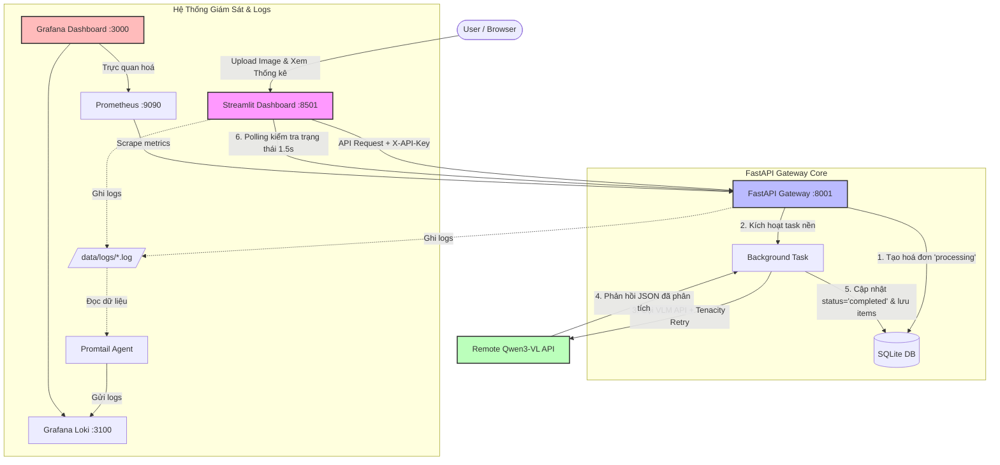

# 🧾 DocUnder - Document Intelligence & Revenue Statistics

DocUnder là hệ thống Trích xuất Thông tin Hoá đơn tự động (Document Intelligence) và Thống kê Doanh thu tích hợp công nghệ VLM (Vision Language Model) hiện đại, hỗ trợ cơ chế xử lý bất đồng bộ và giám sát hiệu năng toàn diện.

---

## 🏗️ Kiến Trúc Hệ Thống (System Architecture)

Sơ đồ dưới đây mô tả luồng hoạt động từ khi người dùng tải ảnh hoá đơn lên giao diện, qua xử lý của mô hình ngôn ngữ lớn Qwen3-VL chạy nền, lưu cơ sở dữ liệu cho đến khi được giám sát bởi hệ thống Observability:



---

## 🌟 Các Tính Năng Nổi Bật (Features)

* **Trích xuất thông tin thông minh**: Sử dụng mô hình `Qwen3-VL-30B` qua VLM Endpoint để đọc thông tin hóa đơn dưới dạng ảnh thô (không nén) để đảm bảo chất lượng hình ảnh tốt nhất khi nhận diện các chi tiết chữ nhỏ.
* **Xử lý chạy nền bất đồng bộ (Async Processing)**: Trích xuất VLM chạy song song thông qua FastAPI `BackgroundTasks`, giúp API Gateway phản hồi ngay lập tức, tránh nghẽn luồng HTTP và tăng khả năng chịu tải.
* **Bảo mật mạnh mẽ**: Xác thực mọi request bằng Header `X-API-Key` được quản lý bảo mật qua biến môi trường trong file `.env`.
* **Khả năng tự phục hồi (Tenacity Retry)**: Hệ thống tự động thử lại tối đa 3 lần với cơ chế trễ luỹ thừa nếu API VLM bị ngắt quãng hoặc quá tải.
* **Giám sát hiệu năng toàn diện (Observability)**: Tích hợp sẵn Prometheus (đo đạc latency, request rate) và Loki + Promtail (thu thập log tập trung của Gateway và Dashboard) để hiển thị trực quan lên Grafana.
* **Tối ưu hóa Prompt và Đánh giá tự động**: Tích hợp công cụ đo đạc độ chính xác của VLM đối với tập dữ liệu thực tế (`ground_truth.json`) với đầy đủ các chỉ số: JSON Parse Rate, Accuracy các trường thông tin và F1-Score của danh sách mặt hàng.

---

## 🛠️ Công Nghệ Sử Dụng (Technology Stack)

| Thành phần | Công nghệ / Thư viện | Tác dụng |
| :--- | :--- | :--- |
| **API Backend Gateway** | FastAPI, Uvicorn, Python 3.10 | Điểm đón yêu cầu, điều phối nghiệp vụ và lưu trữ dữ liệu. |
| **Cơ sở dữ liệu** | SQLite, SQLAlchemy | Lưu trữ metadata hóa đơn và chi tiết danh sách mặt hàng. |
| **Giao diện người dùng** | Streamlit, Plotly, Pandas | Dashboard thống kê doanh thu theo ngày, top sản phẩm và quản lý hóa đơn. |
| **Tích hợp VLM** | OpenAI SDK, Tenacity, Qwen3-VL | Gọi API mô hình thị giác ngôn ngữ để trích xuất dữ liệu có cấu trúc. |
| **Observability** | Prometheus, Loki, Promtail, Grafana | Đo đạc tài nguyên, đếm lượng request và gom logs tập trung. |
| **Đóng gói dự án** | Docker & Docker Compose | Đóng gói tất cả các dịch vụ chạy đồng nhất trên mọi môi trường. |

---

## 🚀 Hướng Dẫn Cài Đặt & Chạy Dự ÁN (Installation)

### Cấu hình biến môi trường trước khi chạy:
Tạo tệp `.env` tại thư mục gốc của dự án với các cấu hình bảo mật:
```env
# Cấu hình bảo mật API Key
API_KEY=docunder_secret_token_2026

# Cấu hình VLM
VLM_BASE_URL=https://props-gory-overlay.ngrok-free.dev/v1
VLM_MODEL=cyankiwi/Qwen3-VL-30B-A3B-Instruct-AWQ-4bit
VLM_API_KEY=none
```

### Phương án 1: Chạy bằng Docker Compose (Khuyên dùng)
Khởi chạy toàn bộ hệ thống (FastAPI, Streamlit, Prometheus, Loki, Promtail, Grafana) chỉ với một lệnh duy nhất:
```bash
docker compose up -d --build
```

Sau khi khởi chạy thành công:
* **Streamlit Dashboard**: [http://localhost:8501](http://localhost:8501)
* **FastAPI Docs (Swagger UI)**: [http://localhost:8001/docs](http://localhost:8001/docs) *(Cần bấm Authorize và nhập `API_KEY` từ file `.env` để kiểm thử)*
* **Grafana Dashboard**: [http://localhost:3000](http://localhost:3000) *(Mặc định tài khoản: `admin` / `admin`)*
* **Prometheus**: [http://localhost:9090](http://localhost:9090)

---

### Phương án 2: Chạy cục bộ (Local Development)
Nếu bạn muốn chạy trực tiếp bằng python trên máy host:

1. **Khởi tạo môi trường ảo và cài đặt thư viện**:
   ```bash
   python3 -m venv .venv
   source .venv/bin/activate
   pip install -e .
   ```

2. **Chạy Backend Gateway**:
   ```bash
   uvicorn serving.gateway.app.main:app --host 127.0.0.1 --port 8001 --reload
   ```

3. **Chạy Streamlit Dashboard**:
   ```bash
   streamlit run dashboard/app.py --server.port 8501 --server.address 127.0.0.1
   ```

---

## 📊 Công Cụ Đánh Giá Chất Lượng Prompt (Prompt Tuning)

Chúng tôi cung cấp một module đánh giá tự động tại [data_preparation/prompt_tuning/evaluate_prompts.py](file:///Users/trannhutquang/Documents/DocUnder/data_preparation/prompt_tuning/evaluate_prompts.py) để đo lường hiệu năng của câu lệnh trích xuất:

1. Đặt ảnh hóa đơn kiểm thử vào thư mục: `data_preparation/evaluation_set/`
2. Cập nhật nhãn thực tế mong muốn (Ground Truth) vào file: [ground_truth.json](file:///Users/trannhutquang/Documents/DocUnder/data_preparation/evaluation_set/ground_truth.json)
3. Thực hiện thay đổi Prompt tại tệp: [prompts.py](file:///Users/trannhutquang/Documents/DocUnder/serving/pipelines/vlm/prompts.py)
4. Chạy lệnh đánh giá để xuất báo cáo chất lượng:
   ```bash
   .venv/bin/python data_preparation/prompt_tuning/evaluate_prompts.py
   ```
   *(Báo cáo kết quả chi tiết từng file sẽ được ghi ra tệp [evaluation_report.md](file:///Users/trannhutquang/Documents/DocUnder/data_preparation/prompt_tuning/evaluation_report.md))*
